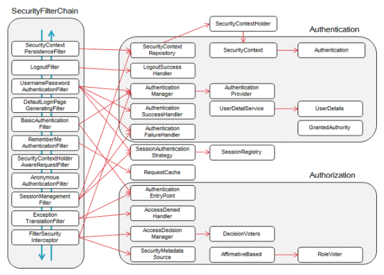

# springSecurityOauth2Guide

### 이 가이드는 delight 프로젝트를 진행하면서 작성한 security oauth2 코드에 대한 설명과 이유, 이해를 바탕으로 하고 있습니다.

jwt 와 security 에서 제공하는 yml 파일 형식의 인증을 따르고 있습니다.       

저의 Oauth2 security 는 크게 5가지로 설정하였습니다.

목차
* Security config
* `http.oauth2Login().successHandler();`
* `http.oauth2Login().failureHandler();`
* `http.userInfoEndpoint().userService();`
* `http.addFilterAfter();`


### Security config

   <details>
   <summary>
   WebSecurityConfigurerAdapter
   </summary>
   <br>

   ```java
   /**
    * @Created by Doe
    * @Date: 2021/07/29
    */
   
   @RequiredArgsConstructor
   @EnableWebSecurity
   public class SecurityConfig extends WebSecurityConfigurerAdapter {
   
       private final CustomOAuth2UserService customOAuth2UserService;
       private final JWTAuthenticationFilter jwtAuthenticationFilter;
       private final CustomAuthenticationSuccessHandler customAuthenticationSuccessHandler;
       private final CustomAuthenticationFailureHandler customAuthenticationFailureHandler;
   
       @Override
       protected void configure(HttpSecurity http) throws Exception {
           
           http.csrf().disable()
                   .authorizeRequests().antMatchers("/", "/h2-console").permitAll()
                   .antMatchers("/restricted").authenticated();
   
           http.addFilterAfter(jwtAuthenticationFilter, BasicAuthenticationFilter.class);
           
           http.oauth2Login()
                   .successHandler(customAuthenticationSuccessHandler)
                   .failureHandler(customAuthenticationFailureHandler)
                   .userInfoEndpoint().userService(customOAuth2UserService);
       }
   }
   ```
   <br>

   이 구조를 간단하게 설명해드리자면,   
   <br>
   로그인 성공 -> `oauth2Login().successHandler`   
   로그인 실패 -> `oauth2Login().failureHandler`   
   회원정보 들어옴 -> `userInfoEndpoint().userService`      
   요청 들어오면 필터 실행 -> `http.addFilterAfter`   
   와 같이 실행됩니다.   
   <br>
   

   그 인자들로 들어가는   
   ```java
   private final CustomOAuth2UserService customOAuth2UserService;
   private final JWTAuthenticationFilter jwtAuthenticationFilter;
   private final CustomAuthenticationSuccessHandler customAuthenticationSuccessHandler;
   private final CustomAuthenticationFailureHandler customAuthenticationFailureHandler;
   ```
   는 모두 만들어진 class 입니다.      
   <br>

   CustomOAuth2UserService 는    
          
   의 구조로 들어가야 하기에   
   ```java
   CustomOAuth2UserService implements OAuth2UserService<OAuth2UserRequest, OAuth2User>
   ```
   다음과 같이 implements 합니다.   

   마찬가지로 모두 security 가 원하는 형식으로 맟춰줍니다.       
         
   ```java
   CustomAuthenticationSuccessHandler implements AuthenticationSuccessHandler
   ```
      
   ```java
   CustomAuthenticationFailureHandler implements AuthenticationFailureHandler 
   ```
   <br>
   
   여기에서 jwt 필터를 설정하는 경우    
       
   다음과 같이 Filter 의 구조를 요구하는데   
   ```java
   JWTAuthenticationFilter extends OncePerRequestFilter
   ```
   저는 [OncePerRequestFilter](https://stackoverflow.com/questions/13152946/what-is-onceperrequestfilter) 를 사용하였습니다.   
   하나의 request 에 한번만 필터가 수행되게 규정하는 놈입니다.   
   JWT 의 유저가 실제 DB 상의 유저인지 확인하기 위해서는 쿼리가 실행되는데 
   이 쿼리가 최소한으로 실행되는 것이 좋다고 판단하여 채택하였습니다.   
   <br>

   그리고    
   ```java
   http.addFilterAfter(jwtAuthenticationFilter, BasicAuthenticationFilter.class);
   ```
   이 코드에서 addFilterAfter 는 security 에서 돌아가는 filter 사이에 어디에다가 넣을것이냐? 를 묻습니다.   
   그래서 해당 필터는 BasicAuthenticationFilter 이후에 실행됩니다.

      

   실제로 넣는 위치는 RememberMeAuthenticationFilter 이전에만 넣으신다면 어디든 상관 없습니다.   
   <br>

   필터 설명
   * SecurityContextPersistenceFilter - 요청(request)전에, SecurityContextRepository에서 받아온 정보를 SecurityContextHolder에 주입합니다.
   * LogoutFilter - 주체(Principal)의 로그아웃을 진행합니다. 주체는 보통 유저를 말합니다.
   * UsernamePasswordAuthenticationFilter - (로그인) 인증 과정을 진행합니다.
   * DefaultLoginPageGeneratingFilter - 사용자가 별도의 로그인 페이지를 구현하지 않은 경우, 스프링에서 기본적으로 설정한 로그인 페이지를 처리합니다.
   * BasicAuthenticationFilter - HTTP 요청의 (BASIC)인증 헤더를 처리하여 결과를 SecurityContextHolder에 저장합니다.
   * RememberMeAuthenticationFilter - SecurityContext에 인증(Authentication) 객체가 있는지 확인하고RememberMeServices를 구현한 객체의 요청이 있을 경우, Remember-Me(ex 사용자가 바로 로그인을 하기 위해서 저장 한 아이디와 패스워드)를 인증 토큰으로 컨텍스트에 주입합니다.
   * AnonymousAuthenticationFilter - SecurityContextHolder에 인증(Authentication) 객체가 있는지 확인하고, 필요한 경우 Authentication 객체를 주입합니다.
   * SessionManagementFilter - 요청이 시작된 이 후 인증된 사용자 인지 확인하고, 인증된 사용자일 경우SessionAuthenticationStrategy를 호출하여 세션 고정 보호 메커니즘을 활성화하거나 여러 동시 로그인을 확인하는 것과 같은 세션 관련 활동을 수행합니다.
   * ExceptionTranslationFilter - 필터 체인 내에서 발생(Throw)되는 모든 예외(AccessDeniedException, AuthenticationException)를 처리합니다.
   * FilterSecurityInterceptor - HTTP 리소스의 보안 처리를 수행합니다.   
   
   [출처 https://siyoon210.tistory.com/32](https://siyoon210.tistory.com/32)     
   <br>

   글을 유심히 읽어보시면   
   RememberMeAuthenticationFilter 이후부터 SecurityContext 의 Authentication 객체를 사용합니다.    
   그럼으로 Authentication 객체가 제대로 사용되기 위해서 그 이전에 jwt 에서 받아 Authentication 객체를 저장해야 합니다.    
   </details>
   <br>

   <details>
   <summary>
   application.yaml
   </summary>
   <br>

   Spring security 는 yaml 파일을 설정하는 것 만으로도 oauth2 에 연결 할 수 있습니다.   
   직접 oauth2 를 연결하신다면   

       

   Rest api 를 통하여 직접 코드, 토큰, 사용자 정보까지 주고 받아야 합니다.   
   Spring security 는 다음 과정들을 간편하게 yml 파일 설정으로 해결해줍니다.   

   우선 yml 파일을 설정하기 전에 정리를 위해 oauth yml 파일을 분리합니다.   

   application.yml

   ```yaml
   spring:
    profiles:
      include:
         - oauth
   ```
   
   application.yml 에 다음과 같이 설정하면 application-oauth.yml 파일을 인식하게 됩니다.   
   <br>
   
   application-oauth.yml   

   ```yaml
   spring:
    security:
      oauth2:
         client:
            registration:
               google:
                  client-id: 
                  client-secret: 
                  scope:
                     - profile
                     - email
               facebook:
                  client-id:
                  client-secret:
                  scope:
                     - email
                     - public_profile
               github:
                  clientId: 
                  clientSecret: 
                  redirectUriTemplate: "{baseUrl}/login/oauth2/code/{registrationId}"
                  scope:
                     - user:email
                     - read:user
               naver:
                  client-id: 
                  client-secret: 
                  redirect-uri: "{baseUrl}/login/oauth2/code/{registrationId}"
                  authorization-grant-type: authorization_code
                  scope:
                     - name
                     - email
                     - profile_image
                  client-name: Naver
               kakao:
                  client-id: 
                  client-secret: 
                  redirect-uri: "{baseUrl}/login/oauth2/code/{registrationId}"
                  authorization-grant-type: authorization_code
                  scope:
                     - profile_nickname
                     - profile_image
                  client-name: Kakao
                  client-authentication-method: POST

            provider:
               naver:
                  authorization-uri: https://nid.naver.com/oauth2.0/authorize
                  token-uri: https://nid.naver.com/oauth2.0/token
                  user-info-uri: https://openapi.naver.com/v1/nid/me
                  user-name-attribute: response
               kakao:
                  authorization-uri: https://kauth.kakao.com/oauth/authorize
                  token-uri: https://kauth.kakao.com/oauth/token
                  user-info-uri: https://kapi.kakao.com/v2/user/me
                  user-name-attribute: id
   ```
   <br>

   client-id : 클라이언트 아이디    
   client-secret : 클라이언트 보안번호   
   provider : 정식 security Oauth2 에 등록되어 있지 않는 네이버와 카카오는 endpoint 들을 지정해야 합니다.   
   scope : Oauth2 provider 마다 사용자 정보를 제공하는 key 값들이 다른데 여기에서 받을 key 값들을 의미한다.   
   정식 Oauth2 provider 들은 다음과 같이 Scope 를 생략할 수도 있다.   

   ```yaml
   spring:
      security:
         oauth2:
            client:
               registration:
                  google:
                     client-id:
                     client-secret:
                  facebook:
                     client-id:
                     client-secret:
                  github:
                     clientId:
                     clientSecret:
   ```
   </details>
   <br>

### http.oauth2Login().successHandler();

   <details>
   <summary>
   CustomAuthenticationSuccessHandler
   </summary>
   <br>
   
   이 클래스는 Oauth2 의 로그인이 성공하면 실행되는 코드를 오버라이딩합니다.   
   반드시 security config 에서 `http.oauth2Login().successHandler(customAuthenticationSuccessHandler)` 를 해주세요.   
   ```java
   /**
    * @Created by Doe
    * @Date: 2021/07/30
    * @ModifiedDate: 2021/08/19
    */
   
   @RequiredArgsConstructor
   @Component
   public class CustomAuthenticationSuccessHandler implements AuthenticationSuccessHandler {
   
      private static final String JWT_SUBJECT = "user";
      private static final int JWT_DUE_DAY = 5;
      private static final String COOKIE_SUBJECT = "jwt";
      private static final int COOKIE_DUE_DAY = 5;
   
      @Value("${spring.frontend.url}")
      private String FRONTEND_URL;
      @Value("${spring.frontend.domain}")
      private String COOKIE_DOMAIN;
   
      @Override
      public void onAuthenticationSuccess(HttpServletRequest request, HttpServletResponse response, FilterChain chain, Authentication authentication) throws IOException, ServletException {
         onAuthenticationSuccess(request, response, authentication);
         chain.doFilter(request, response);
      }
   
      @Override
      public void onAuthenticationSuccess(HttpServletRequest request, HttpServletResponse response, Authentication authentication) throws IOException {
         OAuth2UserProvider OAuth2UserProvider = (OAuth2UserProvider) authentication.getPrincipal();
         String jwt = JwtTokenProvider
                 .generateToken(OAuth2UserProvider.createJWTPayload(), JWT_SUBJECT, TimeUnit.DAYS.toMillis(JWT_DUE_DAY));
   
         Cookie cookie = new Cookie(COOKIE_SUBJECT, jwt);
         cookie.setSecure(true);
         cookie.setMaxAge((int) TimeUnit.DAYS.toSeconds(COOKIE_DUE_DAY));
         cookie.setPath("/");
         cookie.setDomain(COOKIE_DOMAIN);
         response.addCookie(cookie);
      }
   }
   ```

   `implements AuthenticationSuccessHandler` 된 클래스는 2개의 onAuthenticationSuccess function 을 override 해야 합니다.   
   이 두개의 function 의 차이는 FilterChain chain 를 인자로 갖고 있는지인데, FilterChain 은 필터들 사이로 request 와 response 를 이동시키는 역활을 합니다.   
   
   즉 위의 코드로 response 에 쿠키를 추가하여 다음 필터로 `chain.doFilter(request, response);` 를 통해 보내면, response 의 쿠키에 jwt 가 포함되어 나오게 됩니다.   

   물론 `response.sendRedirect(FRONTEND_URL);` 를 하여 쿠키가 포함된 상태로 프런트로 보낼 수 있지만, 모든 security 의 필터를 거쳐서 
   security config 의 설정인 `http.oauth2Login().defaultSuccessUrl(FRONTEND_URL);` 로 보내는 것이 프레임워크를 더 잘 활용한 방법이라고 생각합니다.   
   </details>
   <br>